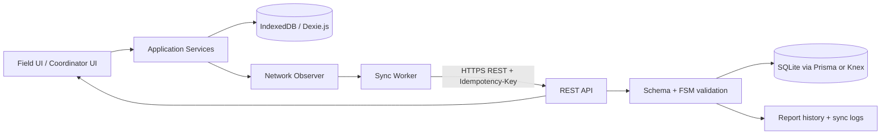

# Technical Requirements Document

## Offline Field Issue Tracker

| Document owner | Architecture and engineering |
|---|---|
| Version | 1.0 |
| Date | 2026-10-02 |
| Runtime target | Modern browsers, Node.js REST API |

## 1. Architecture



The browser is an operational client, not a cache-only view. It owns a durable local queue and optimistic UI state; the API owns authorization, workflow validity, canonical server timestamps, and final persistence.

## 2. Client Requirements

### 2.1 Dexie.js storage model

Recommended tables:

```ts
reports: 'id, status, priority, category, updatedAt, syncState'
syncQueue: '++sequence, reportId, idempotencyKey, state, nextAttemptAt'
outboxEvents: '++sequence, reportId, eventType, createdAt'
```

- `reports.id` is a UUID generated with `crypto.randomUUID()`.
- `syncQueue.idempotencyKey` is stable for one logical create/update operation.
- All writes that change a report and enqueue its sync operation occur in one Dexie transaction.
- Indexes support status, priority, category, and `nextAttemptAt`.
- Local records include `syncState` (`draft`, `pending`, `synced`, `failed`) and `lastSyncError`.

### 2.2 Optimistic UI

The client renders a newly submitted report immediately as `Pending Sync`. Optimism means local durability and presentation, not an assumption that the server accepted the payload. The UI must distinguish:

- **Saved locally:** transaction committed.
- **Pending Sync:** request not acknowledged.
- **Synced:** server returned success or an idempotent replay response.
- **Failed:** user action is required, typically correcting a 422 payload.

## 3. Data Consistency and Sync Strategy

### 3.1 Identity and idempotency

1. Generate the report UUID before the first local save.
2. Generate an idempotency key per logical synchronization command.
3. Send both the report `id` and `Idempotency-Key` header.
4. Store request outcome in `sync_logs` before returning a success response where practical.
5. On a repeated key, return the original response body and status.
6. On the same report ID with a different key, apply normal version/conflict rules.

### 3.2 Retry policy

| Attempt | Delay |
|---:|---:|
| 1 | Immediate |
| 2 | 1 second + jitter |
| 3 | 2 seconds + jitter |
| 4 | 4 seconds + jitter |
| 5+ | 30-second cap, then wait for reconnect/manual retry |

Retry only network failures, timeouts, 408, 429, and 5xx responses. Do not automatically retry a 422. A 409 is retryable only after applying the conflict policy or receiving user confirmation.

### 3.3 Conflict resolution

The server uses Last-Write-Wins for mutable scalar report fields based on a server-normalized `updated_at`/version comparison. Conflict handling must:

- Preserve the accepted server value.
- Preserve the losing client payload in a conflict audit entry.
- Never delete existing `report_history`.
- Return enough data for the client to refresh its local record.

Workflow transitions are stricter than scalar edits: a stale transition is rejected with 409 if the submitted `expected_status` does not match the server status.

## 4. Backend Persistence

SQLite is the assessment persistence target. Prisma provides typed migrations and client generation; Knex is an acceptable alternative when explicit SQL control is preferred. The implementation must use transactions for:

```text
validate transition
update reports
insert report_history
insert sync_logs
```

The unique constraints on `reports.id` and `sync_logs.idempotency_key` are the final duplicate-prevention boundary.

## 5. Error Taxonomy and Client Behavior

| Class | HTTP | Meaning | Client action |
|---|---:|---|---|
| Network failure | none / fetch error | No reliable response | Keep queued; retry on reconnect/backoff |
| Validation error | 422 | Payload is syntactically valid but semantically invalid | Mark failed; show field/reason; require correction |
| Conflict | 409 | Stale version, duplicate key mismatch, or invalid workflow state | Refresh server state; preserve audit; ask for resolution when needed |
| Unauthorized/forbidden | 401/403 | Missing or insufficient identity | Stop retrying; request sign-in/permission |
| Rate limited | 429 | Server asks client to slow down | Honor `Retry-After` |
| Server failure | 500/502/503 | Server could not complete request | Retain queued item; exponential retry; surface incident state |
| Malformed response | client parse error | Contract violation | Retain item; log diagnostic; show sync error |

All error bodies should follow:

```json
{
  "error": {
    "code": "REPORT_INVALID",
    "message": "Description is required",
    "fieldErrors": { "description": "Required" },
    "requestId": "req_01..."
  }
}
```

## 6. API and Security Requirements

- Validate every request with a shared schema (for example Zod or a JSON Schema validator).
- Use parameterized queries through Prisma/Knex.
- Require authenticated coordinator actions in production.
- Do not trust client role, timestamps, status, or permission claims.
- Enforce maximum description length, payload size, and batch size.
- Return a request/correlation ID for support diagnostics.

## 7. Testing Strategy

### Unit tests

- FSM allows each specified valid transition.
- FSM rejects every invalid transition with current state and allowed targets.
- Rejection requires a non-empty reason.
- Retry classifier maps network/422/409/5xx correctly.
- Backoff is capped and deterministic under a fake clock.
- Dexie transaction updates report and queue atomically.

### Integration tests

- `POST /api/reports/sync` creates one report.
- Repeating the same body and idempotency key returns the same outcome and one report.
- Repeating a key after a simulated server restart remains idempotent.
- Batch sync returns independent per-item results.
- A stale status transition returns 409 and writes no transition history.
- A valid transition updates `reports` and inserts exactly one history row in one transaction.

### End-to-end and resilience tests

- Browser DevTools Offline mode, reload, reconnect, and auto-sync.
- Storage survives tab close.
- 500 during sync leaves an item queued.
- 422 exposes correction UI without infinite retry.
- Two clients update the same report and audit records show the conflict.

## 8. Operational Requirements

Log structured events for `sync.received`, `sync.idempotent_replay`, `sync.retryable_failure`, `transition.accepted`, `transition.rejected`, and `conflict.resolved`. Metrics should include queue age, sync success rate, retry count, 409/422/5xx rates, and API latency.

