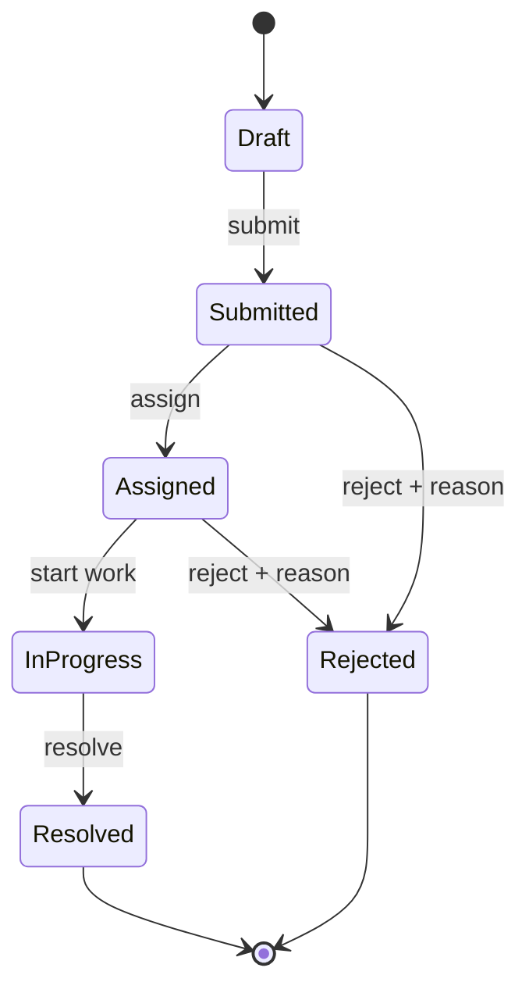
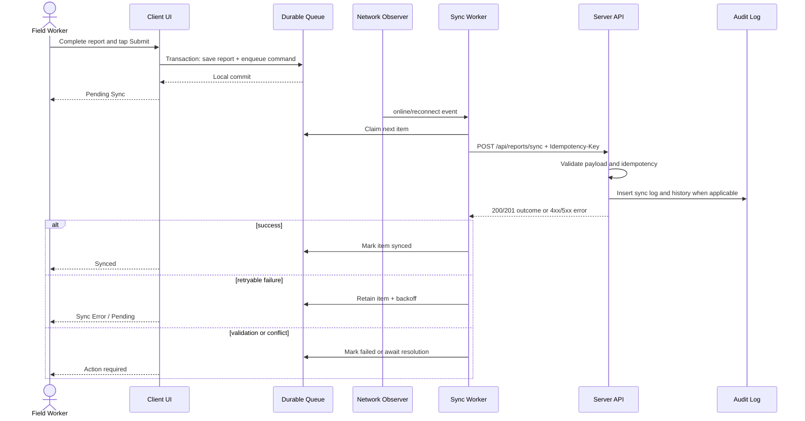

# App Flow and State Machine

## Offline Field Issue Tracker

## 1. Report Lifecycle FSM

### States

| State | Meaning | Terminal? |
|---|---|---|
| Draft | Local composition not submitted | No |
| Submitted | Server accepted report and it awaits triage | No |
| Assigned | Coordinator assigned ownership | No |
| In Progress | Work has started | No |
| Resolved | Work is reported complete | Yes for the current lifecycle |
| Rejected | Coordinator rejected the report with a reason | Yes for the current lifecycle |

### Allowed transitions

| From | To | Required actor | Required data |
|---|---|---|---|
| Draft | Submitted | Field Worker | Valid report payload |
| Submitted | Assigned | Coordinator | Assignee |
| Assigned | In Progress | Coordinator/assignee | Optional note |
| In Progress | Resolved | Coordinator/assignee | Resolution note |
| Submitted | Rejected | Coordinator | Non-empty rejection reason |
| Assigned | Rejected | Coordinator | Non-empty rejection reason |



## 2. Transition Rules

1. The server is authoritative; the client may display an optimistic state but cannot authorize a transition.
2. The request includes `expected_status`; a mismatch returns 409.
3. The transition endpoint validates actor role, current state, required note, and target state before mutation.
4. Invalid transitions return 409 with `currentStatus`, `requestedStatus`, and `allowedTransitions`.
5. No `report_history` row is written for a rejected transition attempt; an operational sync log may record the attempt.
6. Accepted transitions update `reports.status`, `reports.updated_at`, and insert one history row in one transaction.
7. Status strings are a controlled enum; unknown values are rejected with 422.
8. History is append-only and never rewritten to hide a conflict or correction.

Example invalid response:

```json
{
  "error": {
    "code": "INVALID_TRANSITION",
    "message": "Resolved reports cannot transition directly to In Progress",
    "currentStatus": "Resolved",
    "requestedStatus": "In Progress",
    "allowedTransitions": []
  }
}
```

## 3. Re-opening Resolved Issues

Default behavior is to preserve a resolved report and create a linked follow-up report:

1. Coordinator selects `Create follow-up`.
2. The new UUID is generated and its description references the original report.
3. The new report starts in `Draft` locally or `Submitted` when created by an authorized coordinator.
4. The original remains `Resolved`; its history is unchanged.

An explicit reopen feature may be added only with a product decision. If enabled, `Resolved -> In Progress` must require a reason, coordinator permission, and an audit event recording `reopened_from_resolved=true`. It must never be an implicit side effect of an old client retry.

## 4. App and Synchronization Flow



## 5. Offline Queue State

| Queue state | Entry condition | Exit |
|---|---|---|
| Pending | Local submit committed | Claimed by worker or manual retry |
| In Flight | Worker owns item | Success, retryable failure, or terminal failure |
| Retry Scheduled | Network/5xx/429 failure | Backoff timer or reconnect |
| Failed | 422, unrecoverable 409, or permission error | User edits/resolves and retries |
| Synced | Server acknowledgement | Retention policy cleanup |

The worker must use a lease or claim marker to prevent two tabs from processing the same command concurrently. Server idempotency remains required because browser coordination is best-effort.

## 6. Transition Test Matrix

| From | To | Expected |
|---|---|---|
| Draft | Submitted | Allow with valid payload |
| Submitted | Assigned | Allow with coordinator and assignee |
| Assigned | In Progress | Allow |
| In Progress | Resolved | Allow with resolution note |
| Submitted | Rejected | Allow with reason |
| Assigned | Rejected | Allow with reason |
| Draft | Resolved | Reject 409 |
| Resolved | In Progress | Reject by default; follow-up path |
| Rejected | Assigned | Reject 409 |
| Submitted | Rejected | Reject 422 when reason missing |

