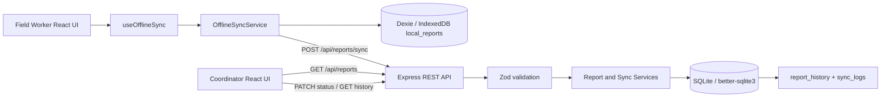

# Offline Field Issue Tracker

An offline-first issue reporting system for field workers and coordinators operating in intermittent or zero-connectivity environments.

Field workers can capture infrastructure issues, location, priority, and observations without a network connection. Reports are durably stored in IndexedDB, placed in a local outbox, and synchronized idempotently when connectivity returns. Coordinators can review server-side reports, apply validated workflow transitions, and inspect the complete audit history.

## Project status

| Area | Implementation |
|---|---|
| Client | React 18, Vite, Dexie.js, IndexedDB, responsive modular CSS |
| Server | Node.js 18+, Express, Zod, SQLite via `better-sqlite3` |
| Synchronization | Client UUIDs, stable `Idempotency-Key`, sequential durable outbox |
| Workflow | Draft → Submitted → Assigned → In Progress → Resolved |
| Audit | SQLite `report_history` and `sync_logs` tables |
| Automated tests | Jest/Supertest backend integration tests; Vitest/React Testing Library frontend integration tests |

> **Assessment focus:** local durability, zero duplicate reports on retry, explicit recovery paths, and server-enforced workflow integrity.

## Contents

- [Product capabilities](#product-capabilities)
- [Quick start](#quick-start)
- [Repository structure](#repository-structure)
- [Architecture overview](#architecture-overview)
- [Synchronization strategy](#synchronization-strategy)
- [Data model and workflow](#data-model-and-workflow)
- [API overview](#api-overview)
- [Assumptions and design decisions](#assumptions-and-design-decisions)
- [Known limitations and future improvements](#known-limitations-and-future-improvements)
- [Testing](#testing)
- [Manual QA verification checklist](#manual-qa-verification-checklist)
- [AI and development tool disclosure](#ai-and-development-tool-disclosure)
- [Time spent log](#time-spent-log)

## Product capabilities

### Field Worker view

- Create a report with category, priority, description, and GPS/manual location.
- Save locally while offline.
- See `Pending Sync`, `Synced`, or `Failed` queue states.
- Retry failed reports manually.
- Continue capturing new reports while earlier reports are waiting to synchronize.

### Coordinator view

- Switch to a coordinator workspace using the role toggle.
- Fetch and filter reports from the server.
- Inspect report details and current workflow state.
- Apply only valid FSM transitions.
- Add rejection reasons or assignment details.
- Expand a chronological audit history timeline.

### Server guarantees

- Client-generated UUIDs prevent identity changes across retries.
- Idempotency keys prevent duplicate outcomes when the same request is replayed.
- Invalid state transitions are rejected with structured HTTP `400` errors.
- Payload validation runs before database insertion and returns HTTP `422`.
- Status updates and audit-history inserts execute in one SQLite transaction.

## Quick start

### Prerequisites

- Node.js `18.18.0` or newer.
- npm 9 or newer.
- A modern Chromium, Firefox, or Safari browser for IndexedDB and online/offline testing.
- PowerShell or another terminal.

### 1. Install backend dependencies

```powershell
cd "C:\Users\Admin\Documents\Weder Internship\backend"
npm install
Copy-Item .env.example .env
```

The backend uses `better-sqlite3` rather than a network database, so no external database server is required.

### 2. Initialize and seed the database

```powershell
npm run db:init
npm run db:seed
```

The seed script creates realistic water-pump and road-blockage reports across every workflow state.

To recreate the local database from scratch:

```powershell
npm run db:reset
```

### 3. Start the backend

```powershell
npm start
```

The API runs at `http://localhost:3000`. Confirm it is healthy:

```powershell
Invoke-RestMethod http://localhost:3000/health
```

For automatic restarts during development:

```powershell
npm run dev
```

### 4. Install and start the frontend

Open a second terminal:

```powershell
cd "C:\Users\Admin\Documents\Weder Internship\frontend"
npm install
Copy-Item .env.example .env
npm run dev
```

The Vite client runs at `http://localhost:5173` and defaults to the backend URL `http://localhost:3000`. Set `VITE_API_BASE_URL` in `frontend/.env` when the backend uses another URL.

### 5. Run automated tests

Backend:

```powershell
cd "C:\Users\Admin\Documents\Weder Internship\backend"
npm test
```

Frontend:

```powershell
cd "C:\Users\Admin\Documents\Weder Internship\frontend"
npm test
```

Frontend production build:

```powershell
npm run build
```

## Repository structure

```text
Weder Internship/
├── README.md
├── 01-PRD.md
├── 02-TRD.md
├── 03-UI-UX-DESIGN-SPECIFICATION.md
├── 04-APP-FLOW-STATE-MACHINE.md
├── 05-BACKEND-SCHEMA-API-CONTRACT.md
├── 06-IMPLEMENTATION-PLAN-COMMIT-BLUEPRINT.md
├── backend/
│   ├── prisma/seed.js
│   ├── scripts/
│   ├── src/
│   │   ├── config/
│   │   ├── controllers/
│   │   ├── database/
│   │   ├── middleware/
│   │   ├── routes/
│   │   ├── services/
│   │   ├── utils/
│   │   └── validators/
│   └── tests/api.integration.test.js
└── frontend/
    ├── src/
    │   ├── db.js
    │   ├── main.jsx
    │   ├── offlineSyncService.js
    │   ├── styles.css
    │   └── useOfflineSync.js
    └── tests/frontend.integration.test.jsx
```

## Architecture overview



### Separation of responsibilities

| Layer | Responsibility |
|---|---|
| React UI | Capture, queue visibility, role-specific workflow interactions |
| `useOfflineSync` | React state projection of local reports and service events |
| `OfflineSyncService` | Online/offline listeners, durable writes, queue processing, retry outcomes |
| Dexie.js | IndexedDB persistence for field reports |
| Express routes/controllers | HTTP contract and response mapping |
| Zod middleware | Reject malformed payloads before business logic/database access |
| Services | Idempotency, FSM validation, transactional business operations |
| SQLite repositories | Prepared statements, filtering, pagination, persistence |

## Synchronization strategy

### Local-first write path

1. The worker submits a form.
2. The browser generates a UUID with `crypto.randomUUID()` if the report does not already have one.
3. Dexie writes the complete report to `local_reports` with `sync_status: "pending"`.
4. The UI immediately shows `Pending Sync`; this means durable locally, not server-accepted.
5. If the browser is online, the service attempts synchronization. If offline, it waits.

### Sync request

The client sends one report at a time to:

```text
POST /api/reports/sync
```

Each request includes:

```text
Idempotency-Key: report-sync-<report-id>-<reported-at>
```

The body includes the stable client UUID, category, description, location, priority, status, and `reported_at`.

### Retry and failure behavior

- Reports with `pending` or `failed` status are eligible for synchronization.
- The service processes the queue sequentially to keep behavior predictable and reduce duplicate concurrent requests.
- `online` and `offline` browser events update the connectivity state.
- A reconnect automatically triggers a sync attempt.
- A manual `Sync Now` or `Retry` triggers the same durable queue path.
- A successful HTTP response changes the record to `synced`.
- A network exception or non-2xx response changes the record to `failed`, increments `retry_count`, records `last_sync_attempt`, and retains all original data.
- No failed request deletes a local report.

### Idempotency and duplicate handling

There are two duplicate-protection layers:

1. **Client layer:** the report UUID is the IndexedDB primary key and the sync service prevents overlapping sync runs with `isSyncing`.
2. **Server layer:** `reports.id` is a SQLite primary key and `sync_logs.idempotency_key` is unique. Replaying a request with the same key returns the recorded successful outcome instead of inserting another report.

This protects against double taps, retries after a lost response, browser reconnect events, and network flapping.

### Conflict handling

- A repeated idempotency key returns the original successful response.
- An existing report UUID with a new idempotency key is safely updated without changing the server workflow status implicitly.
- Workflow transitions include `expectedStatus`; a stale client state is rejected with a structured `400 INVALID_TRANSITION` response.
- Accepted transitions preserve history. Failed requests do not create false transition history.
- Scalar synchronization uses the server record as the authority for workflow status; a future richer conflict model can extend this to field-level versions.

## Data model and workflow

### SQLite tables

| Table | Purpose |
|---|---|
| `reports` | Current canonical report data and workflow status |
| `report_history` | Append-only status and audit timeline |
| `sync_logs` | Idempotency keys and synchronization outcomes |

### Local IndexedDB table

`local_reports` contains:

| Field | Meaning |
|---|---|
| `id` | Client-generated UUID and primary key |
| `category` | Infrastructure category |
| `description` | Worker observation |
| `location` | GPS or manual location object |
| `priority` | `low`, `medium`, `high`, or `critical` |
| `status` | Current report workflow state |
| `reported_at` | Client capture timestamp |
| `sync_status` | `pending`, `synced`, or `failed` |
| `last_sync_attempt` | Last synchronization attempt |
| `retry_count` | Number of attempts |

### FSM

```text
Draft -> Submitted -> Assigned -> In Progress -> Resolved
             |             |
             v             v
          Rejected       Rejected
```

The server is authoritative for transitions. The coordinator UI only offers valid next states, while the API revalidates every transition.

## API overview

| Method | Endpoint | Purpose |
|---|---|---|
| GET | `/health` | API/database liveness |
| POST | `/api/reports/sync` | Single or bounded batch idempotent synchronization |
| GET | `/api/reports` | Paginated list with status, priority, category, and date filters |
| GET | `/api/reports/:id` | Fetch one report |
| PATCH | `/api/reports/:id/status` | Apply a validated FSM transition |
| GET | `/api/reports/:id/history` | Paginated chronological audit history |

### Error semantics

| Status | Meaning |
|---:|---|
| `200` | Successful operation or idempotent replay |
| `400` | Invalid/stale workflow transition or missing idempotency key |
| `404` | Report or route not found |
| `422` | Malformed or semantically invalid request payload |
| `500` | Unexpected server failure |

## Assumptions and design decisions

### Draft deletion is local-only

Drafts are local compositions until submitted. A worker may discard a draft locally because it has not yet entered the server workflow or audit trail. Submitted/pending reports are not silently deleted by synchronization failures. A production implementation should add an explicit confirmation and possibly a trash/restore period for accidental draft deletion.

### Duplicate network requests are dropped safely

The client uses a stable report UUID and stable idempotency key. The server’s primary-key and unique-key constraints are the final authority. A second request is therefore replayed or safely handled rather than creating a second business report.

### Coordinator roles are simulated with a toggle

The assessment needs to demonstrate both user experiences without requiring authentication, identity provisioning, or a full RBAC system. The role switcher changes the UI only. In a production system, the server must derive roles from authenticated identity and must not trust a client-side toggle for authorization.

### SQLite is intentional for the assessment

SQLite keeps setup reproducible and removes the need for an external database. `better-sqlite3` provides synchronous prepared statements and transactions appropriate for this small assessment service. A production deployment with many writers would likely use PostgreSQL.

### Location is portable JSON

Location is stored as JSON text rather than a database-specific spatial type. This keeps the schema portable and supports GPS, accuracy, source, and manual landmarks. A geospatial product would use a spatial database/index.

### Server status is authoritative during sync

An offline client may display a locally submitted status, but synchronization does not silently force a server workflow transition. Coordinators transition server state through the explicit status endpoint, preserving workflow integrity.

## Known limitations and future improvements

1. **No background service worker sync:** synchronization currently runs while the application is open. A service worker with Background Sync would improve recovery after tab closure.
2. **No server-to-client push:** coordinator changes are refreshed through requests rather than WebSockets, Server-Sent Events, or push notifications.
3. **No CRDT-based bidirectional merge:** the current policy preserves audit history and treats server workflow state as authoritative. A multi-writer domain with frequent concurrent edits could use field-level versions or CRDTs.
4. **No production authentication/RBAC:** the role toggle is a demonstration mechanism, not an authorization boundary.
5. **No attachments:** photographs, videos, compression, resumable uploads, and offline media quotas are outside this assessment.
6. **No advanced geospatial search:** location supports capture and display but not map indexing, geofencing, or route optimization.
7. **Single-process SQLite target:** horizontal scaling, connection pooling, migrations, backups, and operational failover need a production database strategy.
8. **Limited retry scheduling:** failed items retry on reconnect or manual action; production would add capped exponential backoff, jitter, and a dead-letter/support queue.
9. **No automated accessibility audit:** the UI includes high-contrast, keyboard, and large-target design choices, but a full axe/Screen Reader audit should be added.
10. **No end-to-end browser automation:** the integration suites use jsdom/fake IndexedDB and mocked HTTP. Playwright/Cypress would add browser-level offline throttling coverage.

## Testing

### Backend tests

Run:

```powershell
cd "C:\Users\Admin\Documents\Weder Internship\backend"
npm test
```

The Jest/Supertest suite uses a disposable SQLite database and covers:

- Valid `Draft → Submitted` transition.
- Invalid `Draft → Resolved` transition with structured HTTP `400`.
- Exact-payload idempotent synchronization.
- One persisted report, one history row, and one sync log after replay.
- Empty descriptions and invalid priorities returning `422`.
- Prevention of malformed data reaching the database.

### Frontend tests

Run:

```powershell
cd "C:\Users\Admin\Documents\Weder Internship\frontend"
npm test
```

The Vitest/React Testing Library suite uses a real Dexie schema backed by `fake-indexeddb` and covers:

- Creating an issue while offline.
- Persisting the issue in IndexedDB.
- Rendering it as `Pending Sync`.
- Coordinator status transitions calling the correct `PATCH` endpoint.
- Changing a report from `Pending Sync` to `Synced` after a successful mock API response.

### Testing priorities

Sync idempotency and FSM transitions received the highest coverage because they protect the two most damaging classes of field-operations failure:

1. **Duplicate or lost reports:** network retries, double taps, response timeouts, reconnect events, and network flapping can otherwise create duplicate business records or leave workers unsure whether a report was received. The tests verify both HTTP outcomes and persisted row counts.
2. **Invalid operational state:** an issue that jumps from Draft directly to Resolved, or is changed using a stale status, can bypass triage and undermine dispatch accountability. The tests verify allowed transitions, forbidden transitions, structured errors, and unchanged persistence after rejection.
3. **Validation is the input boundary:** malformed descriptions and priorities are tested to ensure invalid data is rejected before insertion.
4. **UI persistence is the user-trust boundary:** the frontend tests prove that offline capture renders from durable local state rather than a transient React state object.

## Manual QA verification checklist

### Start the application

1. Start the backend:

   ```powershell
   cd "C:\Users\Admin\Documents\Weder Internship\backend"
   npm start
   ```

2. Start the frontend in a second terminal:

   ```powershell
   cd "C:\Users\Admin\Documents\Weder Internship\frontend"
   npm run dev
   ```

3. Open `http://localhost:5173` in Chrome.
4. Open DevTools with `F12`.
5. Open the **Application** tab and confirm an IndexedDB database named `offline-field-issue-tracker` appears after the first local save.

### Offline capture

1. In DevTools, open the **Network** tab.
2. Set the throttling dropdown to **Offline**.
3. Confirm the global banner changes to **Offline**.
4. Stay in the **Field Worker** view.
5. Enter a category, priority, description, and manual landmark.
6. Click **Save issue locally**.
7. Confirm the report appears in **Outbox / Local Queue** with a **Pending Sync** badge.
8. In DevTools → Application → IndexedDB, inspect `local_reports` and confirm the row has:
   - A UUID.
   - The entered description.
   - `sync_status = pending`.
   - `retry_count = 0`.
9. Reload the page while still offline.
10. Confirm the report remains in the local queue.

### Recovery and automatic sync

1. Change Network throttling back to **No throttling**.
2. Confirm the banner changes to **Online**, then **Syncing**.
3. Confirm the queue item changes to **Synced**.
4. Open the backend coordinator view and refresh the report list.
5. Confirm the report appears once on the server.
6. Use the browser Network panel to replay the same sync request if available.
7. Confirm no duplicate report appears.

### Failed sync and manual retry

1. Switch Network back to **Offline**.
2. Create another issue and confirm **Pending Sync**.
3. Temporarily stop the backend or use DevTools request blocking to force a server failure.
4. Restore browser connectivity and trigger **Sync Now**.
5. Confirm the report changes to **Failed** and remains in IndexedDB.
6. Restore the backend.
7. Click **Retry** on the failed queue item.
8. Confirm the item eventually becomes **Synced** without losing its description or location.

### Coordinator workflow

1. Select the **Coordinator** role toggle.
2. Confirm server reports load into the list.
3. Select a submitted report.
4. Choose **Assigned**, enter an assignee, and click **Apply**.
5. Confirm the request is `PATCH /api/reports/:id/status`.
6. Expand **Audit history** and confirm the transition has timestamp, actor, and state information.
7. Attempt an invalid transition using a stale report or a direct invalid API request.
8. Confirm the API returns structured HTTP `400` and the report state remains unchanged.
9. Test rejection from Submitted or Assigned with a reason.
10. Confirm rejection without a reason is rejected with validation feedback.

## AI and development tool disclosure

### Tools used

- Claude 3.5 Sonnet
- Claude Opus
- Visual Studio Code / Copilot SDK agent tooling
- Node.js, npm, Vite, Jest, Vitest, React Testing Library, Supertest, Dexie.js, fake IndexedDB
- Chrome DevTools for manual offline verification

### Specific tasks AI was used for

- Architecture scaffolding.
- Prisma schema generation and schema-contract design. The delivered runtime uses raw SQLite DDL with `better-sqlite3` for zero external database dependencies; the schema design was kept compatible with the documented Prisma-style model.
- Test suite writing for backend and frontend integration paths.
- React UI and offline synchronization scaffolding.
- Documentation and API contract consolidation.

### What was accepted unchanged

- SQLite database schema structure and initial route boilerplate were accepted as the baseline implementation.
- The initial separation into routes, controllers, services, database, middleware, and validators was retained.

### What was modified or rejected

- Claude’s initial sync endpoint was adjusted to enforce idempotent UUID handling rather than treating an existing client ID as a duplicate error.
- Explicit edge-case protection was added against duplicate sync triggers during network flapping and overlapping reconnect/manual sync actions.
- FSM violations were aligned to the assessment requirement of structured HTTP `400` responses.
- Sync payloads were aligned to the `reported_at` contract.
- Failed synchronization preserves local data and records retry metadata instead of deleting or silently accepting the item.

### Verification method

- Manual Chrome DevTools offline testing using Network → Offline/No throttling.
- Backend Jest/Supertest integration test execution.
- Frontend Vitest/React Testing Library integration test execution with fake IndexedDB.
- Vite production build.
- Direct smoke testing of health, filtering, synchronization replay, and workflow endpoints.

## Time spent log

Approximate implementation time: **5.5 hours**.

| Phase | Duration | Work completed |
|---|---:|---|
| Product and technical design | 45 min | PRD, TRD, UX, FSM, schema/API, and implementation-plan documents |
| Backend foundation | 55 min | Express structure, SQLite schema, repositories, controllers, services, validation |
| Backend business logic | 45 min | Idempotent sync, report history, FSM transactions, pagination, filtering |
| Backend verification | 30 min | Seed data, endpoint smoke tests, malformed payload and transition checks |
| Frontend offline layer | 45 min | Dexie schema, `OfflineSyncService`, reconnect handling, durable queue behavior |
| Responsive React UI | 60 min | Connectivity banner, role switcher, field capture, queue, coordinator detail/history UI |
| Automated tests | 35 min | Jest/Supertest backend tests and Vitest/RTL frontend tests |
| Documentation and final QA | 25 min | Setup instructions, disclosures, manual QA checklist, production build verification |
| **Total** | **5 hr 40 min** | End-to-end assessment implementation and verification |

## Supporting documents

- [Product Requirements Document](<./01-PRD.md>)
- [Technical Requirements Document](<./02-TRD.md>)
- [UI/UX Design Specification](<./03-UI-UX-DESIGN-SPECIFICATION.md>)
- [App Flow and State Machine](<./04-APP-FLOW-STATE-MACHINE.md>)
- [Backend Schema and API Contract](<./05-BACKEND-SCHEMA-API-CONTRACT.md>)
- [Implementation Plan and Commit Blueprint](<./06-IMPLEMENTATION-PLAN-COMMIT-BLUEPRINT.md>)

